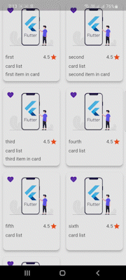
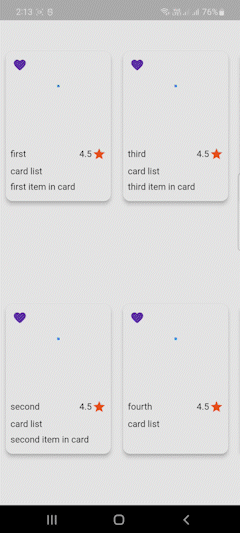
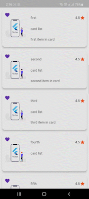
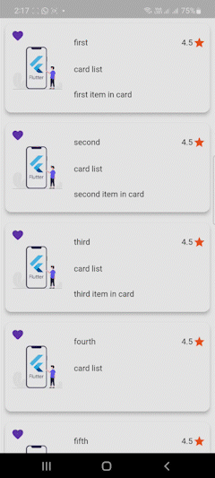
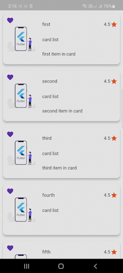
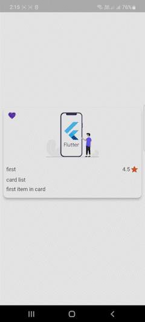

<!--
Flutter multiviewlist help developers to create multipurpose list view with flutter.
author : dharmaraj k
-->

TODO: you can use multiviewlist with multiple options. this package used for create a vertical list
or horizontal list. and also this package used for creating a gridview with vertical or horizontal
scrolling. And inside the content also aligned vertical or horizontally. if you want multi selected
list or Dismissible list you can also using this single package. you can add error widget if data has null.
and also default shimmer loading widget.

## Features

TODO: Features

* vertical scrolling grid view
* 
* horizontal scrolling grid view
* 
* Dismissible list
* 
* multi selected list
* 
* horizontally aligned content widget with vertical list
* 
* Vertical scrolling list view
* 
* horizontal scrolling list view
* 

## Getting started

TODO: Add the package In your pubspec.yaml
multiviewlist:0.0.1

TODO: Import and use
import 'package:multiviewlist/multiviewlist.dart'

## Usage

TODO:To create a multiviewlist.

* to set list view or grid view using the viewType parameter
* to set scroll direction using scroll direction parameter.
* to set card content vertical aligned or horizontal aligned, using content axis
* all the card data's are customizable

MultiViewList(
   data: items,
   scrollDirection: Axis.vertical,
   viewType: ViewType.gridView,
   contentAxis: Axis.vertical,
   background: Colors.white,
   isRating: true,
   isFav: true,
   isDismissible: false,
   isLoading: false,
   isSelectableList: false,
   selectedColor: Colors.grey.shade200,
),

## Important model

user need to set array data with this model. this is mandatory

class ItemModel {
int? id;
String? image;
String? title;
String? subTitle;
String? description;
String? rating;
Function(int)? onFav;
Function(int)? onDelete;
Function(int)? onTab;
Function(int)? onSelected;
bool? isFav;
bool? isSelected;

ItemModel(
{this.id,
this.image,
this.title,
this.subTitle,
this.description,
this.rating,
this.onFav,
this.onTab,
this.onSelected,
this.onDelete,
this.isFav,
this.isSelected
});
}

